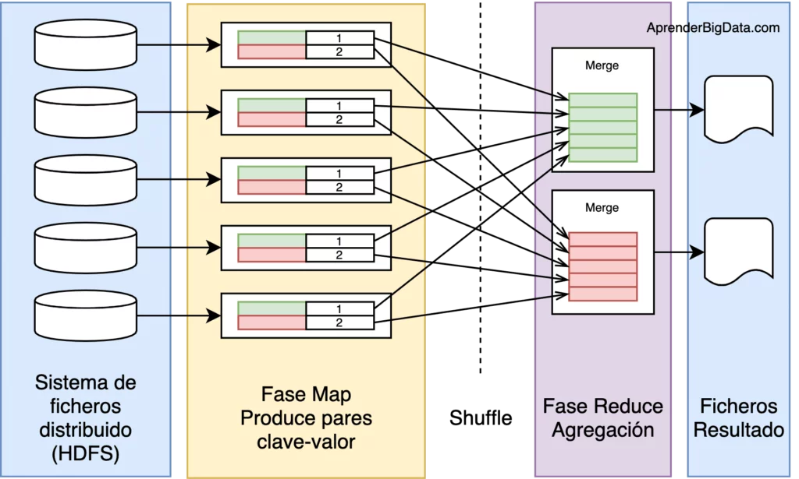

  

# Jeff Hammerbacher y el desarrollo de la infraestructura de datos y del Data Warehouse de Facebook

> Jeff Hammerbacher, el cientifico del proyecto que vamos a analizar, estudió Matemáticas en Harvard, habia trabajado antes ya como analista cuantitativo y llegó a Facebook en 2006. Allí fundó y lideró el Data Team, un equipo que combinaba análisis, ingeniería y construcción de infraestructura de datos. (Kelman, 2010).

# ***Desarrollo de la infraestructura de Data Science y Data Warehouse de Facebook.***

Cuando Hammerbacher llegó a Facebook, existía una herramienta interna que se llamaba ***Watch Page***. Esta utilizaba las bases de datos MySQL que alimentaban el sitio y ejecutaba consultas para obtener información como el número de usuarios activos y su distribución entre  diferentes redes. Hammerbacher dice que su primera tarea habia sido crear una versión más profesional del sistema, osea un ***data warehouse*** capaz de recopilar un rango mucho más amplio de datos. (Kelman, 2010).

> [!WARNING]
> Un Data Warehouse es un sistema diseñado para reunir y organizar grandes cantidades de datos de Facebook en un lugar preparado específicamente para analizarlos.

Además de eso, las preguntas que el equipo quería responder estaban principalmente relacionadas con el crecimiento de Facebook. Como qué redes estaban creciendo, cuáles no y qué factores podían explicar ese crecimiento y/o decrecimiento.

Después, el crecimiento de los datos hizo que la infraestructura original dejara de ser suficiente. Facebook pasó de trabajar con aproximadamente 15 TB de datos en 2007 a ***2 PB***, y algunos procesos diarios que inicialmente tardaban más de un día podían realizarse en pocas horas utilizando Hadoop. (Facebook Engineering, 2008).

# ***Características del Proyecto.***

- [x] ¿Qué se hizo?
- [ ] ¿Qué información se utilizó?
- [ ] ¿Cómo se recopilaban los datos?
- [ ] ¿Cómo se procesaban los datos?
- [ ] ¿Qué función tenía el Data Warehouse?
- [ ] ¿Qué análisis se realizaba?
- [ ] Herramientas

# *¿QUÉ SE HIZO?*

Basicamente el objetivo principal era desarrollar una infraestructura que permitiera a Facebook aprovechar de la manera más eficiente los datos generados por sus usuarios.

El trabajo incluyó aspectos como:

  
- Crear y dirigir el equipo inicial de datos de Facebook. (Kelman, 2010).
- Desarrollar un Data Warehouse más profesional.  (Kelman, 2010).
- Organizar la información para facilitar su análisis.  (Kelman, 2010).
- Separar las tareas de análisis de las bases de datos utilizadas para el funcionamiento normal de Facebook. (Facebook Engineering, 2008; Facebook Engineering, 2009).
- Desarrollar sistemas que fueran capaces de procesar cantidades cada vez mas grandes de información. (Facebook Engineering, 2008; Facebook Engineering, 2009).
- Crear herramientas que permitieran realizar consultas sobre estos grandes grupos de datos. (Facebook Engineering, 2008; Facebook Engineering, 2009).
- Usar los datos para entender el comportamiento de los usuarios y el crecimiento o tendencias de la plataforma. (Facebook Engineering, 2009; Facebook Engineering, 2013).

# *¿QUÉ INFORMACIÓN SE UTILIZÓ?*
El proyecto usó información generada por la misma plataforma de Facebook.
Despliega para conocer algunos ejemplos más específicos de la información que usaron.

  
<Resumen> Haz click para desplejar mas info </Resumen>
- Actividad de los usuarios en la plataforma. (Kelman, 2010).
- Usuarios activos. (Kelman, 2010).
- Interacciones de los usuarios en cuanto a alguna variable. (Kelman, 2010).
- Crecimiento de la red o tendencias de este. (Kelman, 2010).
- Uso de productos. (Kelman, 2010).
- Actividad dentro de la plataforma en general o específico a analizar. (Kelman, 2010).
- Registros generados por los sistemas. (Facebook Engineering, 2008).

# *¿CÓMO SE RECOPILABAN LOS DATOS?*
Los datos provenían principalmente de la actividad que ocurría dentro de Facebook, como ya lo mencionamos arriba.

Cada interacción de los usuarios con la plataforma podía generar información útil para entender el comportamiento y el crecimiento de Facebook. A medida que el tamaño de Facebook aumentó, fue necesario desarrollar sistemas especializados para recopilar y transportar grandes cantidades de registros.

Uno de estos sistemas fue ***Scribe***, desarrollado por Facebook para recopilar y transportar grandes volúmenes de datos provenientes de los registros de los sistemas. (Facebook Engineering, 2008).

> [!WARNING]
> Scribe funcionaba como un sistema de recopilación y transporte de registros ***(logs)*** dentro de la infraestructura de datos de Facebook. Los diferentes servidores de Facebook generaban de forma continua información sobre las actividades que ocurrían en la plataforma, y Scribe recibía esos registros desde muchos servidores, los organizaba y los enviaba hacia sistemas de almacenamiento para que pudieran ser procesados luego. Podemos decir que Scribe actuaba como un intermediario entre los servidores que generaban los datos y la infraestructura donde esos datos eran almacenados y analizados. (Facebook Engineering, 2008).

# *¿CÓMO SE PROCESABAN LOS DATOS?*

A medida que aumentaba la cantidad de información, las ***bases de datos tradicionales*** dejaron de ser suficientes para algunas tareas de análisis. Entonces Facebook comenzó a utilizar ***tecnologías de procesamiento distribuido***, que permitían dividir los datos y las tareas entre diferentes computadores. Una de las tecnologías más importantes fue Hadoop. (Facebook Engineering, 2008).

Hadoop permitió procesar grandes cantidades de información utilizando múltiples computadores en lugar de depender de una sola máquina.(Facebook Engineering, 2010).

Hadoop Distributed File System, permitió distribuir grandes cantidades de información entre diferentes máquinas. (Facebook Engineering, 2010).

MapReduce permitió dividir las tareas de procesamiento en diferentes operaciones que podían ejecutarse de manera distribuida. Facebook Engineering. (2010)

Hive permitió realizar consultas sobre grandes cantidades de datos almacenados en Hadoop mediante un sistema de consultas de más alto nivel.  (Facebook Engineering, 2009).

# *¿QUÉ FUNCIÓN TENÍA EL DATA WAREHOUSE?*

El Data Warehouse era bastante importante porque Facebook generaba información desde diferentes partes de su plataforma. Entonces, en lugar de hacer todos los análisis directamente sobre las bases de datos que utilizaba Facebook para funcionar, la información podía organizarse en un sistema diseñado específicamente para el análisis.(Kelman, 2010).

Entonces podemos decir que se dividía en: Una base de datos operacional (En donde el usuario inicia sesión, Facebook consulta una base de datos y muestra la informacipon) y por otra parte en Data Warehouse (En donde hay millones de actividades que pasan a través de Data Warehouse, y este realiza las consultas previas al análisis). (Facebook Engineering, 2009).

# *¿QUÉ ANÁLISIS SE REALIZABA?*
> ¿Cuántos usuarios estaban activos? (Kelman, 2010)
> ¿Qué tan rápido estaba creciendo la red? (Kelman, 2010)
> ¿Cómo estaban distribuidos los usuarios? (Kelman, 2010)
> ¿Cómo interactuaban los usuarios con la plataforma de Facebook en cuanto a alguna variable a analizar? (Kelman, 2010)
> ¿Cómo cambiaba el uso de los productos?  (Facebook Engineering, 2009)
> ¿Qué ciclos o tendencias podían identificarse en la actividad de los usuarios de Facebook? (Kelman, 2010)

# *HERRAMIENTAS*

|Herramienta                 | Función                                |
|----------------------------------------|-------------------------------------------------------------------|
| MySQL    | Base de datos utilizada en los primeros sistemas de Facebook                       | 
|Data Warehouse|Organización y almacenamiento de datos para análisis                |
|Hadoop |Procesamiento distribuido de grandes cantidades de datos|
|HDFS   | Almacenamiento distribuido |
|MapReduce| Procesamiento distribuido|
|Hive| Consultas sobre grandes conjuntos de datos|
|Scribe| Recopilación y transporte de registros |

  
- [x] ¿Qué se hizo?
- [x] ¿Qué información se utilizó?
- [x] ¿Cómo se recopilaban los datos?
- [x] ¿Cómo se procesaban los datos?
- [x] ¿Qué función tenía el Data Warehouse?
- [x] ¿Qué análisis se realizaba?
- [x] Herramientas
  

# *¿CUÁL FUE EL IMPACTO DE TODO ESTE PROYECTO?*

El proyecto permitió desarrollar una forma mucho más estructurada de utilizar sus datos. Además de que pudo incursionar de nueva manera el Big Data y también, la empresa avanzo hacia una organización más orientada a los datos, en la que la información podía utilizarse para comprender:

- El comportamiento de los usuarios en Facebook.  (Kelman, 2010).
- El crecimiento/ decrecimientos de la plataforma y tendencias.  (Kelman, 2010).
- El uso de los productos. (Facebook Engineering, 2009).
- Los cambios dentro de la red en general o en cuanto a algo. (Facebook Engineering, 2013).

  
  

# *REFERENCIAS*
Facebook Engineering. (2008). Hadoop. Meta Engineering. https://engineering.fb.com/2008/06/04/core-infra/hadoop/

Facebook Engineering. (2008). Facebook’s Scribe technology now open source. Meta Engineering. https://engineering.fb.com/2008/10/24/web/facebook-s-scribe-technology-now-open-source/

Facebook Engineering. (2009). Hive: A petabyte scale data warehouse using Hadoop. Meta Engineering. https://engineering.fb.com/2009/06/10/web/hive-a-petabyte-scale-data-warehouse-using-hadoop/

Facebook Engineering. (2010). Looking at the code behind our three uses of Apache Hadoop. Meta Engineering. https://engineering.fb.com/2010/12/10/core-infra/looking-at-the-code-behind-our-three-uses-of-apache-hadoop/

Facebook Engineering. (2011). Moving an elephant: Large scale Hadoop data migration at Facebook. Meta Engineering. https://engineering.fb.com/2011/07/27/core-infra/moving-an-elephant-large-scale-hadoop-data-migration-at-facebook/

Facebook Engineering. (2013). Presto: Interacting with petabytes of data at Facebook. Meta Engineering. https://engineering.fb.com/2013/11/06/core-infra/presto-interacting-with-petabytes-of-data-at-facebook/

Kelman, G. (2010). Jeff Hammerbacher on Hadoop, Facebook and a surprising bit about Microsoft. Redfin. https://www.redfin.com/news/jeff_hammerbacher_on_hadoop_facebook_and_a_surprising_bit_about_microsoft/

